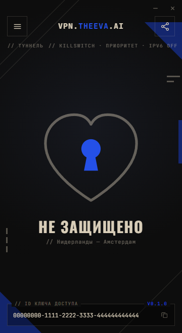
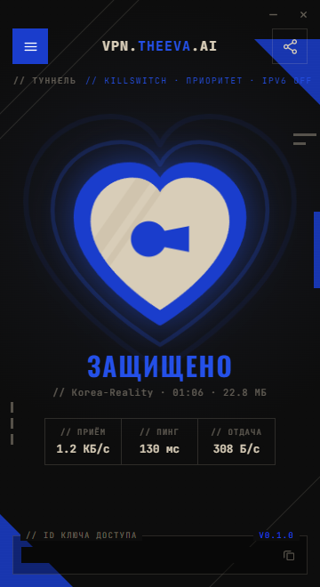
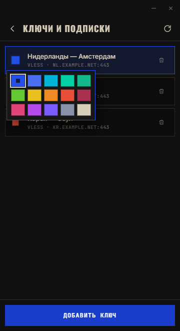
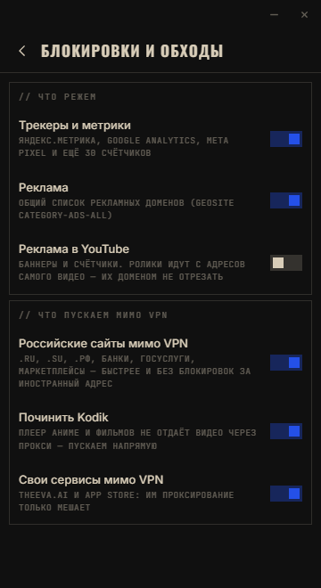
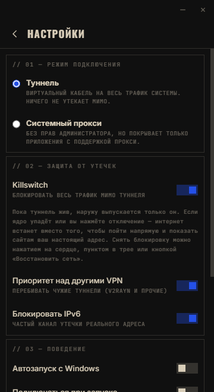
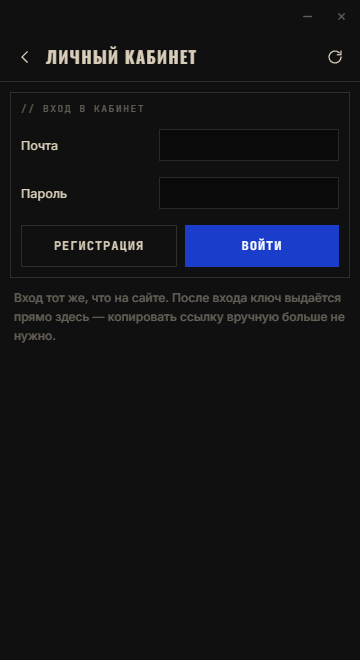

<div align="center">

# VPN.THEEVA.AI

**VPN-клиент для Windows: одно сердце вместо кнопки, ключ VLESS/Reality — и весь трафик уходит в туннель.**








</div>

---

## Что это

Клиент на ядре [sing-box](https://github.com/SagerNet/sing-box) для серверов
**Xray / VLESS + Reality + XTLS-Vision**. Задача — то, чего не хватает на ПК:
понятное приложение, где пользователь вставляет ключ и нажимает одну кнопку.

- **Одно нажатие.** Вставил `vless://…` или ссылку на подписку — нажал — работает.
- **Виртуальный кабель.** Системный TUN-адаптер `EVA` с метрикой 1: весь трафик системы
  идёт в туннель, а не «только браузер». Игры, Telegram, торренты, консоль — всё внутри.
- **Приоритет над другими VPN.** Чужие туннели (v2rayN, OpenVPN, WireGuard, TAP-адаптеры)
  на время сессии отодвигаются на метрику 9000 и возвращаются обратно при отключении.
  Больше не нужно удалять один клиент, чтобы заработал другой.
- **Killswitch.** Исходящий трафик по умолчанию запрещён; разрешены только сам туннель,
  ядро, приложение и локальная сеть. Упало соединение — трафик стоит, а не утекает в обход.
- **Без утечек адреса.** DNS перехватывается и уходит в туннель, IPv6 блокируется,
  UDP тоже идёт в туннель (WebRTC видит адрес сервера, а не ваш).
- **Не ломает сеть.** Всё, что приложение включило, оно умеет выключить: при отключении,
  при выходе, кнопкой «Восстановить сеть» и даже после аварийного падения — по метке на диске.
- **Цвет у каждого ключа.** Польша — красный, Нидерланды — синий: цвет активного ключа
  виден прямо в замочной скважине сердца, сервер узнаётся не читая названия.
- **Личный кабинет.** Остаток трафика и срок подписки прямо в приложении, вход на
  [vpn.theeva.ai](https://vpn.theeva.ai) в один клик.
- **Блокировки и обходы** — пять переключателей: трекеры, российские сайты мимо VPN,
  починка Kodik, торренты мимо VPN, App Store напрямую. Списки короткие и предсказуемые: резать рекламу
  доменами приложение не берётся — это работа Pi-hole или расширения в браузере.
- **Личный кабинет внутри приложения.** Вход тот же, что на сайте: ключ выдаётся сам,
  сервер меняется в один клик, видны тариф, баланс, трафик и срок.
- **Без телеметрии.** Открытый код, никаких аналитик и «партнёрских» модулей.

## Поддерживаемые ключи

`vless://` (Reality, XTLS-Vision, uTLS), `vmess://`, `trojan://`, `ss://`, `hysteria2://`
Транспорты: TCP/RAW, WebSocket, gRPC, HTTPUpgrade, HTTP/2.
Подписка — ссылка `https://…` со списком ключей (обычный текст или base64), обновляется
в один клик и раз в 12 часов сама.

## Установка

Готовые сборки — на вкладке [Releases](../../releases):

| Файл | Что это |
|------|---------|
| `EVA-VPN-x.y.z-x64.exe` | установщик (ярлыки, чистое удаление) |
| `EVA-VPN-x.y.z-portable.exe` | портативная версия, без установки |

### Почему приложение просит права администратора

Сборка помечена как требующая повышения прав (`requestedExecutionLevel: requireAdministrator`),
поэтому Windows показывает запрос UAC при каждом запуске. Это не перестраховка: без прав
администратора **невозможно поднять туннель вообще**. Для него нужно:

- создать виртуальный сетевой адаптер через драйвер Wintun;
- прописать маршруты по умолчанию и метрику интерфейса;
- добавить правила брандмауэра, если включён killswitch;
- задать DNS на адаптере.

Каждое из этих действий Windows разрешает только процессу с повышенными правами. Без них
приложение не смогло бы даже создать адаптер и упало бы с ошибкой «Отказано в доступе».

Если давать права не хочется, в настройках есть режим **системного прокси**: он работает
без UAC, но покрывает только программы, умеющие ходить через прокси, — браузеры и часть
мессенджеров. Игры, консольные утилиты и всё остальное пойдут мимо.

### «Неизвестный издатель» при запуске

Установщик не подписан сертификатом разработчика, поэтому UAC пишет «Издатель неизвестен»,
а SmartScreen может показать синее окно. Это ожидаемо для сборки без платной подписи:
проверить целостность файла можно по хешу из релиза, а исходники открыты целиком.

## Блокировки и обходы

| Переключатель | Что делает |
|---|---|
| Трекеры и метрики | Режет Яндекс.Метрику, Google Analytics, Meta Pixel и ещё три десятка счётчиков |
| Российские сайты мимо VPN | `.ru`, `.su`, `.рф`, банки, госуслуги, маркетплейсы идут напрямую: быстрее и без блокировок за иностранный адрес |
| Починить Kodik | Плеер не отдаёт видео через прокси — пускаем напрямую |
| Торренты мимо VPN | Раздача и закачка идут напрямую через провайдера. **Выключено по умолчанию.** Ловится двумя способами сразу: по имени программы (22 клиента, от qBittorrent до Zona) и по содержимому пакетов — ядро отличает торрент от обычного трафика по первым байтам, поэтому переименованный или портативный клиент тоже попадает под правило |
| App Store мимо VPN | `appstore.com`, `apps.apple.com`, `itunes.apple.com`, `mzstatic.com`. Apple обрывает загрузки через прокси: магазин виснет на «Ожидание», обновления не докачиваются. Единственный обход, который стоит держать включённым — в интерфейсе он помечен «обязательно включить» |

Списки живут в [src/main/rules.js](src/main/rules.js) — добавить домен значит дописать
строку, никаких перекомпиляций правил.

### Торренты

Туннель на торрентах — это чужой канал, оплаченный за месяц, забитый раздачей. Правило
уводит их напрямую, но за это надо заплатить честностью: **при включённом обходе ваш
настоящий адрес видит каждый участник раздачи**, и провайдер видит, что вы качаете.
Выключено по умолчанию именно поэтому — включать стоит осознанно.

Ловится в два захода. По имени процесса — тогда мимо туннеля идёт всё, что делает
клиент, включая обращения к трекерам и DHT, ещё до того, как по трафику что-то понятно;
DNS таких программ тоже уходит напрямую, иначе имя трекера разрешалось бы через туннель,
а шли бы к нему мимо. По распознанному протоколу — на случай переименованного файла,
портативной сборки или качалки, встроенной в другую программу.

Проверено на живом ядре, не только на схеме:

    рукопожатие BitTorrent  ->  ["direct"]  правило: protocol=bittorrent => route(direct)
    HTTP из qbittorrent.exe ->  ["direct"]  правило: process_name=[...] => route(direct)
    обычный HTTP            ->  ["proxy"]   правило: final
    то же с выключенным тумблером: всё уходит в ["proxy"]

Блокировки рекламы здесь нет намеренно. Общие списки рекламных доменов ложно срабатывают
на CDN и платёжных виджетах и ломают сайты чаще, чем чистят выдачу, а ролики в YouTube
раздаются с тех же адресов, что и само видео, — доменом их не отрезать. Кому нужна
фильтрация, лучше поднять Pi-hole или AdGuard Home на своём DNS: там она видна, отлаживается
и не завязана на VPN.

**Изменения не перезапускают туннель молча.** Смена любого правила во время работы
копится и применяется кнопкой «Применить»: перезапуск обрывает все живые соединения,
и делать это без спроса — плохая идея. Killswitch и приоритет включаются на лету,
без переподключения вообще.

## Личный кабинет

Вход тот же, что на [vpn.theeva.ai](https://vpn.theeva.ai) — почта, пароль и код 2FA,
если он включён. Сессия хранится зашифрованной (DPAPI), пароль на диск не попадает.
После входа приложение показывает тариф, баланс, остаток дней и трафика, текущий сервер,
и умеет менять сервер: выбор уходит на сайт, оттуда приходит новый ключ, который тут же
подставляется в приложение.

Ключ из кабинета живёт в списке отдельной строкой: смена сервера заменяет его, а не плодит
дубликаты, и цвет, который вы ему назначили, сохраняется. Первая выдача ключа создаёт клиента
в панели и перезапускает там ядро — это долго, и прокси перед сайтом успевает ответить 502
раньше, чем сайт закончит работу. Приложение это знает и повторяет запрос: ключ к тому моменту
уже готов.

Адрес сайта можно переопределить настройкой `siteBase` (например, `http://localhost:3001`) —
удобно, когда бэкенд правится локально.

## Как это ловит весь трафик

```
приложения ──► адаптер EVA (TUN, метрика 1) ──► sing-box ──► VLESS/Reality ──► сервер
                     ▲                               │
   чужие туннели ────┘ отодвинуты на 9000            └── DNS перехвачен, IPv6 отрезан

брандмауэр: исходящее по умолчанию Block
   allow: интерфейс EVA · sing-box.exe · само приложение · локальная сеть · DHCP
```

Всё, что не попало в туннель, не выходит наружу вообще. Метрика 1 против 9000 решает спор
маршрутов, если рядом работает другой VPN-клиент.

Killswitch **по умолчанию выключен** — и вот почему. Это политика брандмауэра
«исходящее по умолчанию запрещено» плюс список разрешений. Пока туннель жив, наружу ходит только он. Если ядро упадёт или вы
нажмёте отключение, интернет встанет вместо того, чтобы пойти напрямую и показать сайтам
настоящий адрес. Снять блокировку можно нажатием на сердце, пунктом в трее или кнопкой
«Восстановить сеть».

Ограничение, о котором надо знать: петлю `127.0.0.1` разрешить правилом можно, а
петлю IPv6 `::1` — нет, брандмауэр Windows отвечает «указан петлевой IPv6-адрес».
При этом `localhost` в Windows разрешается сначала в `::1`. Поэтому при включённом
killswitch программы теряют доступ к локальным сервисам на этой же машине —
например, Cloudflare Tunnel перестаёт достукиваться до сайта, который сам же
отдаёт наружу. Известные демоны туннелей (cloudflared, ngrok, frpc, tailscaled)
приложение разрешает по пути к файлу, но общего решения у этой проблемы нет.

## Уже запущенные программы

Новые соединения уходят в туннель сразу, а вот открытые до подключения живут своей жизнью:
браузер держит пул keep-alive, мессенджеры — долгие сокеты, и Windows помнит, каким
интерфейсом ходить к адресу. При подключении приложение сбрасывает кэш маршрутов, кэш DNS
и таблицу соседей — после этого система решает заново и большинство программ переезжает
в туннель само. Тем, кто держит собственный пул соединений, помогает только перезапуск.

Системный прокси при этом **не** ставится: туннель забирает весь трафик и без него, а
лишняя запись в настройках Windows переживала бы падение приложения.

Состояние системных изменений пишется в `%USERPROFILE%\.eva-vpn-guard.json`. Если приложение
убили через диспетчер задач, при следующем запуске оно увидит метку и снимет блокировки само;
то же делает кнопка «Восстановить сеть» и деинсталлятор.

## Когда что-то пошло не так

Приложение пишет журнал на диск: `%APPDATA%\EVA VPN\logs\eva-<дата>.log`, по файлу
на запуск, последние десять хранятся. Запись синхронная — строки переживают жёсткое
убийство процесса. Открыть папку: меню → «Журнал подключения» → значок папки.

Там же кнопка **проверки соединения**: она резолвит имя и тянет живой HTTP через ядро,
а не гадает по индикатору. В ответе видно, проходит ли трафик, какая задержка и не
работает ли рядом чужой туннель.

**Два VPN одновременно — главная причина «сайты открываются через раз».** Каждый ставит
свой маршрут по умолчанию и свой перехватчик DNS, и система выбирает между ними
непредсказуемо. Приложение теперь замечает соседа при подключении и говорит об этом прямо.

Переподключение после обрыва ограничено: три обрыва за десять минут — и приложение
останавливается с понятным сообщением вместо бесконечного круга.

## Сборка из исходников

```bash
npm ci
node scripts/fetch-core.mjs      # скачает sing-box и наборы правил в ./core
npm start                        # запуск в режиме разработки
npm run dist                     # установщик + портативная сборка в ./dist
```

Требуется Node.js 20+. Ядро в репозитории не хранится — оно скачивается скриптом
и в CI, чтобы репозиторий оставался лёгким.

## Как устроено

```
src/main/
  main.js       окно, трей, IPC, права администратора
  core.js       запуск и остановка sing-box, статистика через Clash API
  config.js     сборка конфига sing-box из профиля (TUN / прокси, DNS, правила)
  parse.js      разбор ссылок vless/vmess/trojan/ss/hysteria2 и подписок
  netfix.js     приоритет туннеля, killswitch, системный прокси, «Восстановить сеть»
  autostart.js  автозапуск задачей планировщика с повышенными правами
  store.js      настройки и профили в JSON
src/renderer/   интерфейс: HTML + CSS + JS без фреймворков
```

Приложение не патчит ядро: оно генерирует ему конфиг и следит за процессом.
Обновить ядро — значит подменить `core/sing-box.exe` (или запустить `fetch-core.mjs`
с новой версией). `npm run check` прогоняет генерацию конфигов через `sing-box check`
для всех типов ключей — это же делает CI.

## Планы

- [ ] Модули маршрутизации с готовыми пресетами (реклама, трекеры, соцсети, стриминг) — как в Streisand / Shadowrocket
- [ ] Раздельное туннелирование по приложениям и доменам
- [ ] Выбор сервера по минимальной задержке и автопереключение
- [ ] QR-код для передачи ключа
- [ ] Сборки для macOS и Linux

## Лицензия

[GPL-3.0-or-later](LICENSE). Приложение поставляется вместе с ядром
[sing-box](https://github.com/SagerNet/sing-box) (GPL-3.0), наборы правил —
[sing-geosite](https://github.com/SagerNet/sing-geosite).
Фирменный стиль и знак — [theeva.ai](https://theeva.ai) / [vpn.theeva.ai](https://vpn.theeva.ai).
